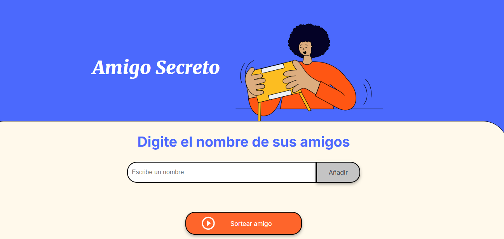

<h1 align="center">Amigo Secreto</h1>

<p align="center">
  
</p>

¡Bienvenido al repositorio del proyecto **Amigo Secreto**! Esta aplicación te permite organizar y sortear los nombres de tus amigos para el juego de Amigo Secreto de manera fácil y divertida.

## Visita el Proyecto

Puedes acceder a la aplicación en vivo aquí: [Amigo Secreto](https://jheisongz.github.io/challenge-amigo-secreto_esp-main/)

## Características

- **Agregar Amigos**: Ingresa los nombres de tus amigos y añádelos a la lista.
- **Sortear**: Asigna aleatoriamente un amigo secreto a cada participante.
- **Interfaz Sencilla**: Fácil de usar y diseñada para una experiencia fluida.

## Cómo Usar

1. **Ingresar Nombres**:
   - Escribe el nombre de un amigo en el campo de texto.
   - Haz clic en "Añadir" para agregar el nombre a la lista.

2. **Sortear**:
   - Una vez que hayas agregado todos los nombres, haz clic en "Sortear amigo" para asignar aleatoriamente un amigo secreto a cada participante.

## Requisitos

- Navegador web moderno.
- JavaScript habilitado.

## Instalación

Si deseas clonar y ejecutar este proyecto localmente, sigue estos pasos:

1. Clona el repositorio:
   ```bash
   git clone https://github.com/jheisonGZ/challenge-amigo-secreto_esp-main.git